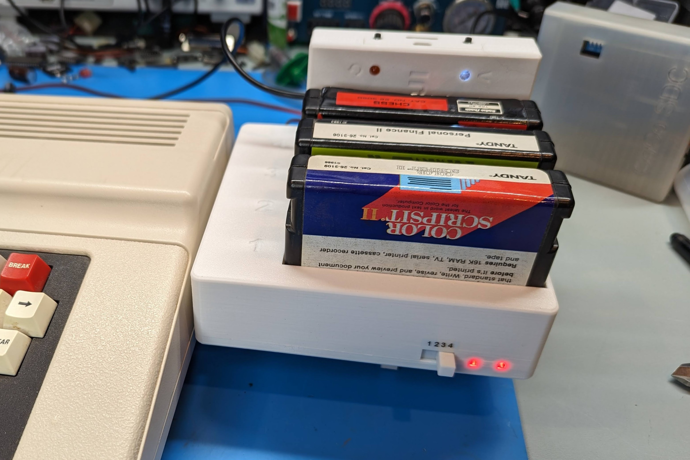
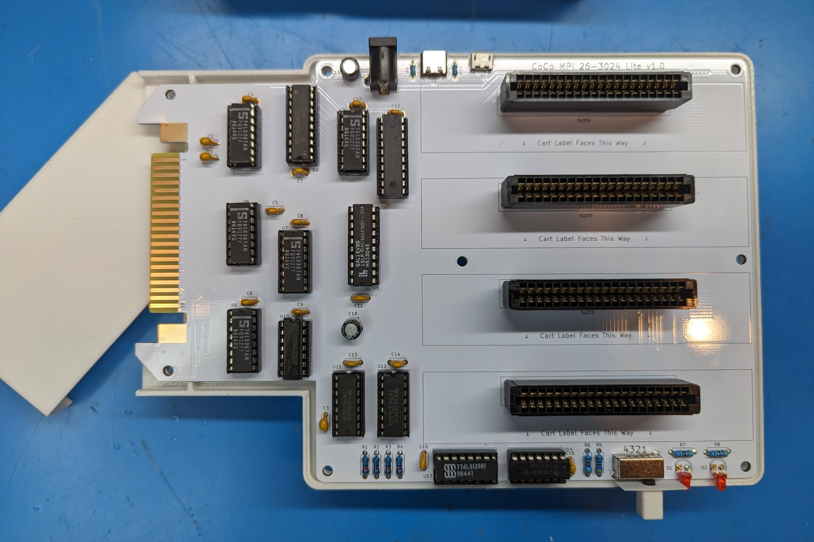
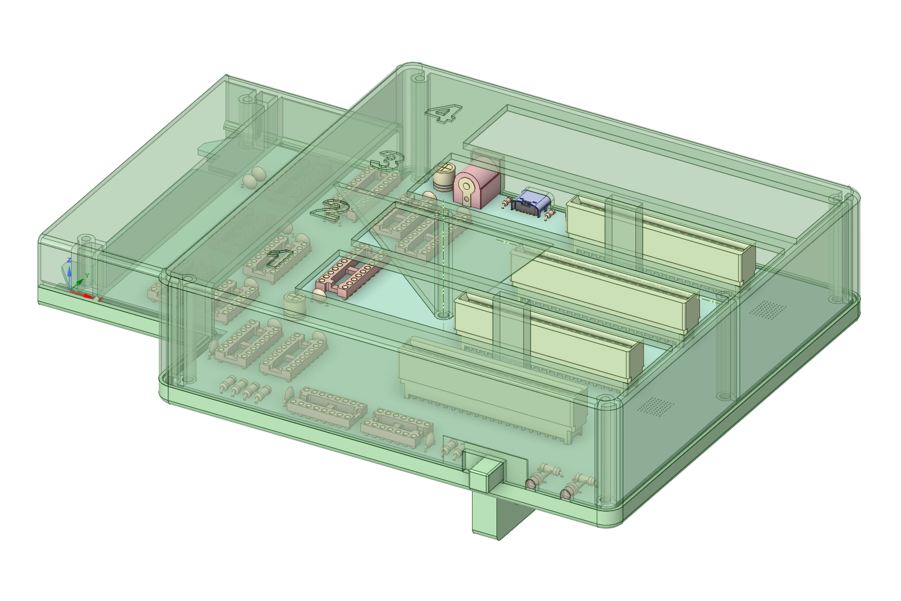

Inspired by the work of [TheLittleEngineers](https://github.com/TheLittleEngineers/CoCoDragon-MultiPakInterface-CC-Multi-Pak_Version_1.2), this is my respin of the Tandy 26-3024 Multi-Pak (MPI).  It's targeted at the DIY builder so the schematic is pretty much straight out of the Tandy service manual with all THT parts, minus the power section (more on that later).  The board size has been reduced as much as possible, and I added two LED's to indicate power to the MPI and Coco to minimize accidental unplugging when still powered up.  The cart slots are numbered one to four, front to back, like a real MPI, but are rotated 90 degrees so the cart labels face forward.  This was mainly done to better suit devices like the Coco Fujinet that have indicator LED's on the top of the cart and I saw Ed has done the same with his MPI variants.

For power you have a couple of different options.  You can power directly via an external 5V PSU via either a barrel jack, USB-C, or MicroUSB ports.  Or you can use a 7.5V PSU into the barrel jack and a pair of AMS1117 5V VRM's will split the power load between slots 1/2 and 3/4.  For +12V and -12V there are solder jumpers on the back to take that from the Coco1 cartridge port, but no options to provide those voltages on a Coco2 or 3.

The case is a kickstand design to save on filament costs and printing time, but does have a 35mm tall top cover to better support the carts. There are also two different top designs, one that is mostly open from the cart slots to the board, and another that is fully shrouded, but uses almost double the filament.  I personally haven't printed the latter option yet.

Schematic - https://djtersteegc.github.io/Tandy-Color-Computer-Multi-Pak/Tandy%20Color%20Computer%20Multi-Pak%20Schematic.pdf

# BOM

CSV - https://djtersteegc.github.io/Tandy-Color-Computer-Multi-Pak/Tandy%20Color%20Computer%20Multi-Pak%20BOM.csv

iBOM - https://djtersteegc.github.io/Tandy-Color-Computer-Multi-Pak/ibom.html

Google Sheet with some AliExpress links - https://docs.google.com/spreadsheets/d/16bxERXJ9wRitJPs6XrFosqCZR3fNDdbd6zl7ltthO44/edit?usp=sharing

I tend the buy most everything from China, either AliExpress of UTSource (for logic). For power, first figure out how you want to power the board and then pick the correct optional parts.  I'm assuming everyone will install the barrel jack, either for direct 5V or to feed 7.5V into the VRM's.

# PCB Assembly

# 3D Printing the Case

| Part                    | Filament |
| ----------------------- | -------- |
| MPI Top.stl             | 75g      |
| MPI Bottom.stl          | 62g      |
| MPI Cart Top.stl        | 20g      |
| MPI Foot.stl            | 12g      |
| MPI Switch.stl          | 1g       |
| MPI Top Full Shroud.stl | 137g     |

# Final Assembly

# Getting a Board to Build Your Own

Gerbers are available is you want to run your own batch. I would recommend ENIG (gold) finish since this is plugging into your cart edge connector. Otherwise if you are in the US hit my up on the Coco or FujiNet Discord (hideehoo is my username there) and if I have any extras I can drop one in the mail for $15 shipped.

# Versions

1.0 - Assembled and tested.  Initial batch of PCB's had produced had an incorrect switch footprint that required trimming of the locating tabs and the silkscreen with the slot numbering is reversed.  That has been corrected in the version 1.0 design files and gerbers in the intial upload to this repo.

